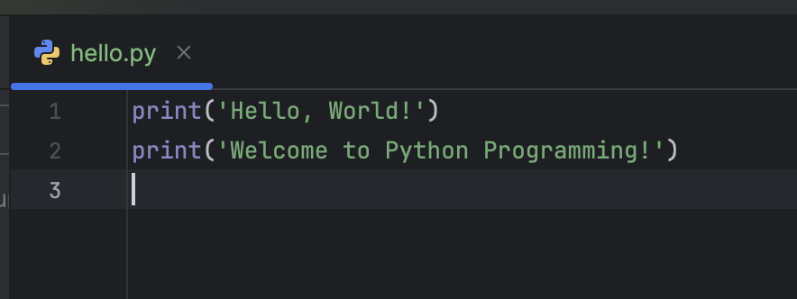
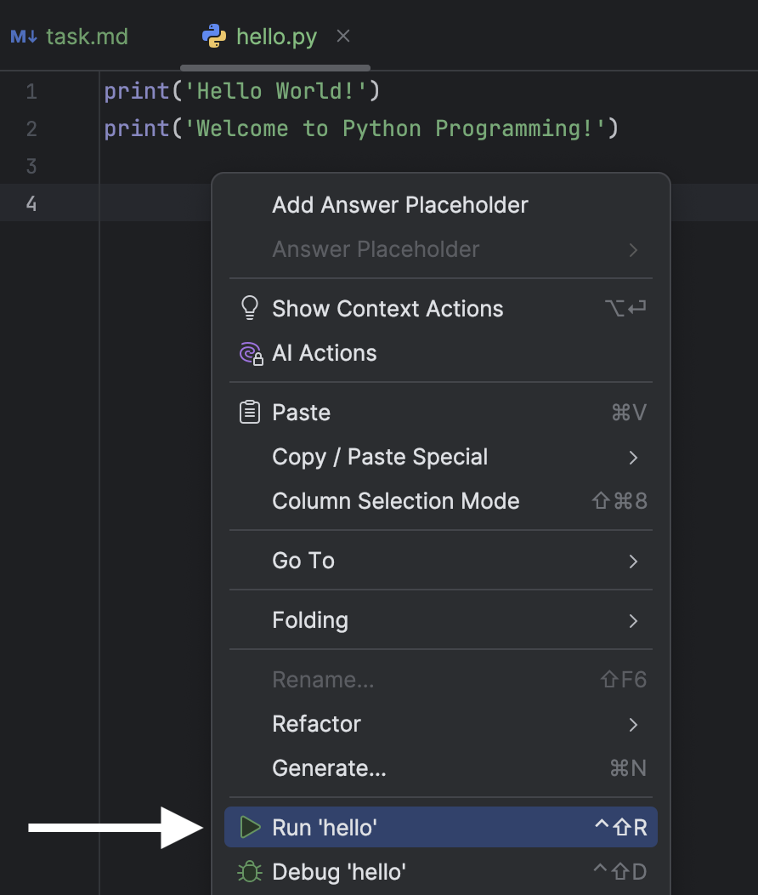

## Editor

The <b>Editor</b> is your playground where you will be programming. You can experiment here while you work on theoretical tasks and quizzes without being checked.

For programming assignments, the Editor is where you’ll fix the existing code or write your own code from scratch. This code will be checked.

To run the code, right-click in the Editor view so you can see the context menu, then choose the Run option.

