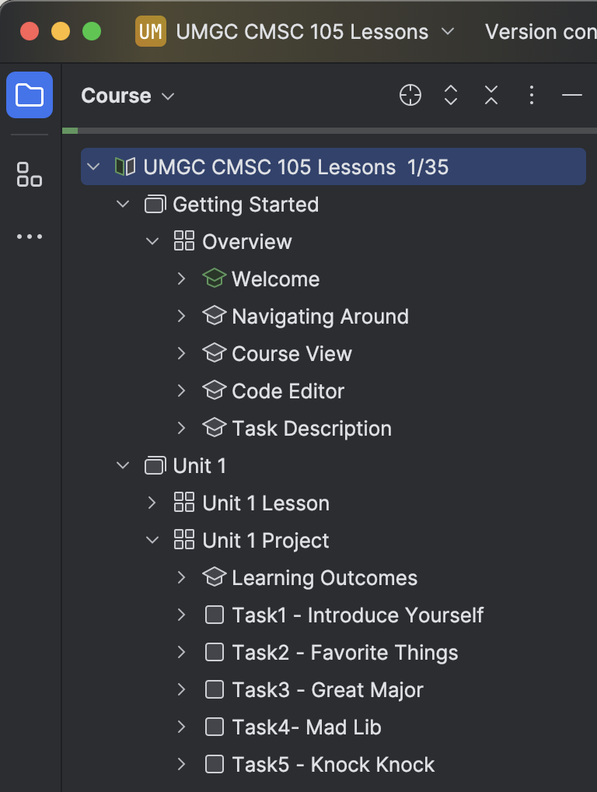

## Course View

<b>Course View</b> shows you the course syllabus: a list of lessons with tasks.

You can navigate to a task by double-clicking its name.

- To hide the Course View window, click the Project Tool Window button (folder icon in tool menu) or press &shortcut:ActivateProjectToolWindow;. This will give you more space for the Editor and Task Description windows.
- To show the hidden Course View window, click the Project Tool Window button (or press &shortcut:ActivateProjectToolWindow;) again.

