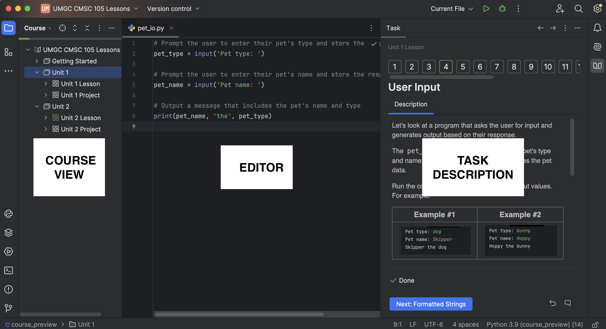

### Working with courses
This course is structured as a list of lessons.
Each lesson contains several tasks.

When you open a course, you will see the main tool 
windows used for navigation: 
<b>Course View</b>, <b>Editor</b>, and <b>Task Description</b>:

Click the "Next" button to navigate to the next task.