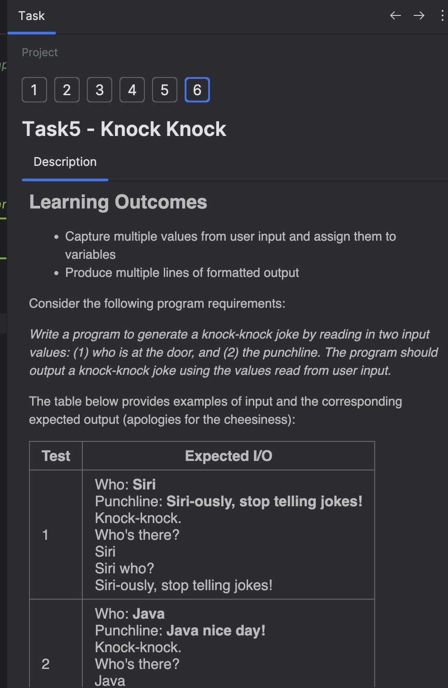

## Task Description

The **Task Description** window gives you all the
information you need to complete a task.

For theoretical tasks, the description provides learning and reading materials.
For quizzes, it offers multiple choice questions.
For programming assignments, it states the problem to be solved.

