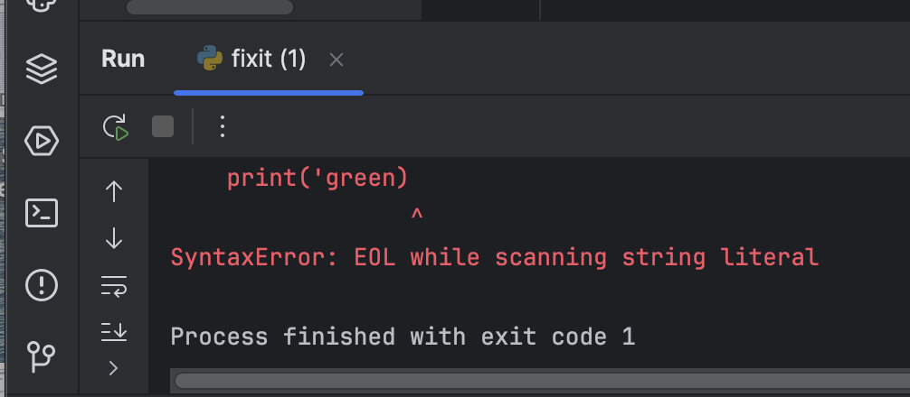
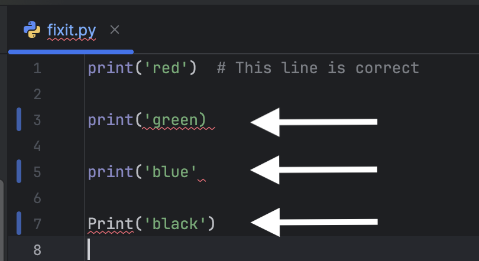
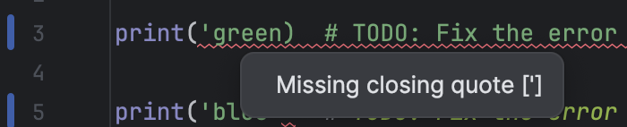
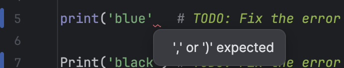
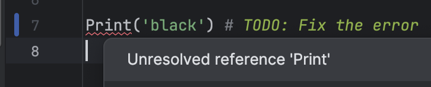

The file `fixit.py` has several syntax errors that cause the
program to fail. Try running the program.  You should see a syntax error message for the print statement on line 3:

Lines 3, 5,and 7 each have a syntax error, which are underlined in red.
The code editor may initially highlight only the first error on
line 3.  Once you fix that error, the errors on lines 5 and 7 should appear.

Hover the mouse over the red underlined code to see a message that describes the issue.

| Line | Syntax Error Message                                                                       | Fix the Syntax Error                               |
|------|--------------------------------------------------------------------------------------------|----------------------------------------------------|
| 3    |       | Add the missing quote before the right parenthesis |
| 5    |       | Add the missing right parenthesis                  |
| 7    |  | Lowercase the function name                        |                              |

### Code Challenge

1. Fix the syntax errors on lines 3, 5, and 7.
2. Click the "Check" button to confirm the code runs and produces the expected output.