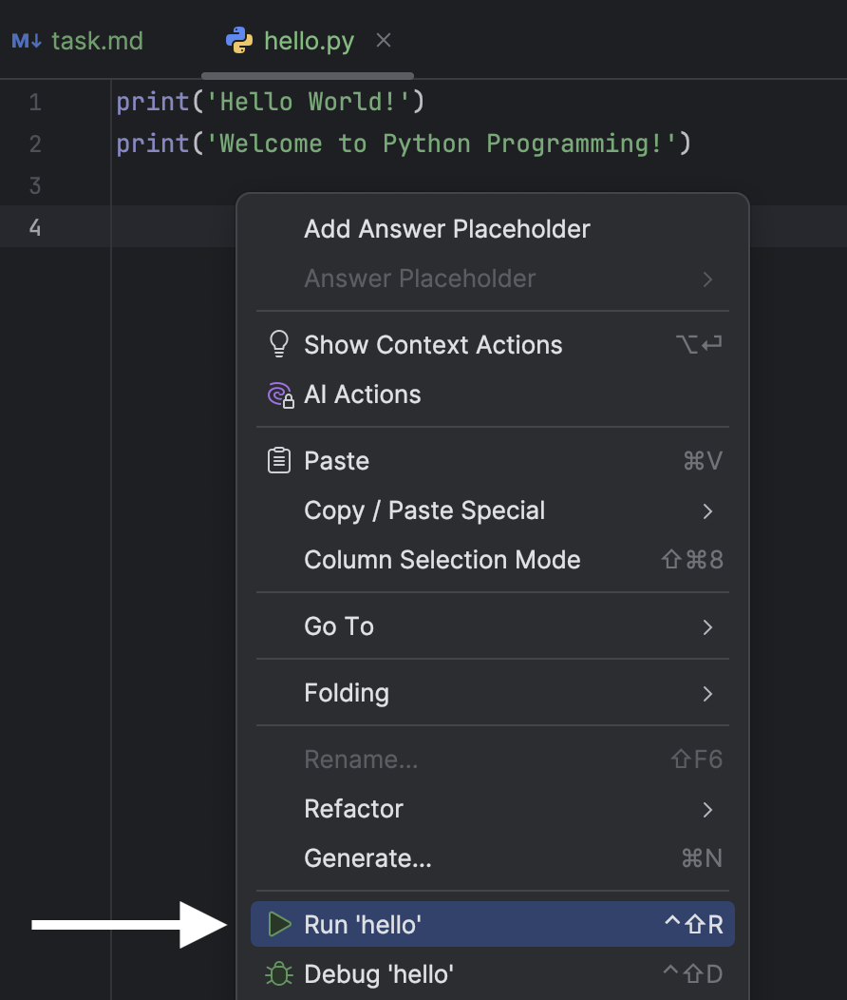
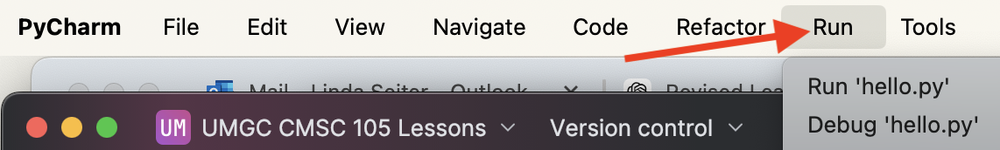
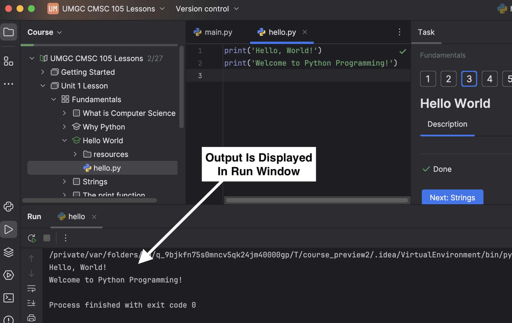

Let’s take a look at a small Python program, also called a
Python script, that outputs a greeting when executed.

The code editor in the center of the screen displays
the content of the file `hello.py`.

- The file `hello.py` contains two lines of Python code.
- Each line is a **print statement** that calls the `print()` function to display text on the screen.
- The text between the parentheses, not including the quotes, is what is output to the screen.

When you **run** `hello.py`, each print statement is executed in sequence.

### How to Run `hello.py`

There are several ways to run `hello.py` in PyCharm.  Try each of the following methods to run the code:

| **Method**                                      | **Example**                                                          |
|-------------------------------------------------|----------------------------------------------------------------------|
| **Right-click in the Editor**, then select **Run 'hello'**  |  |
| **From the Menu Bar**, select **Run > Run 'hello.py'**      |       |
| **Use the Shortcut** ⌃⇧R (Mac) or **Ctrl+Shift+R** (Windows/Linux) |                                                                      |

When running the code, PyCharm will display the output
in the **Run Window** at the bottom of the screen.

**Challenge:** Try changing the code to alter the greeting that is printed.
Be careful not to delete the single quotes that surround the text.

> **Note:** The terms **"run a program"** and **"execute a program"** will be used
> interchangeably throughout the lessons.
