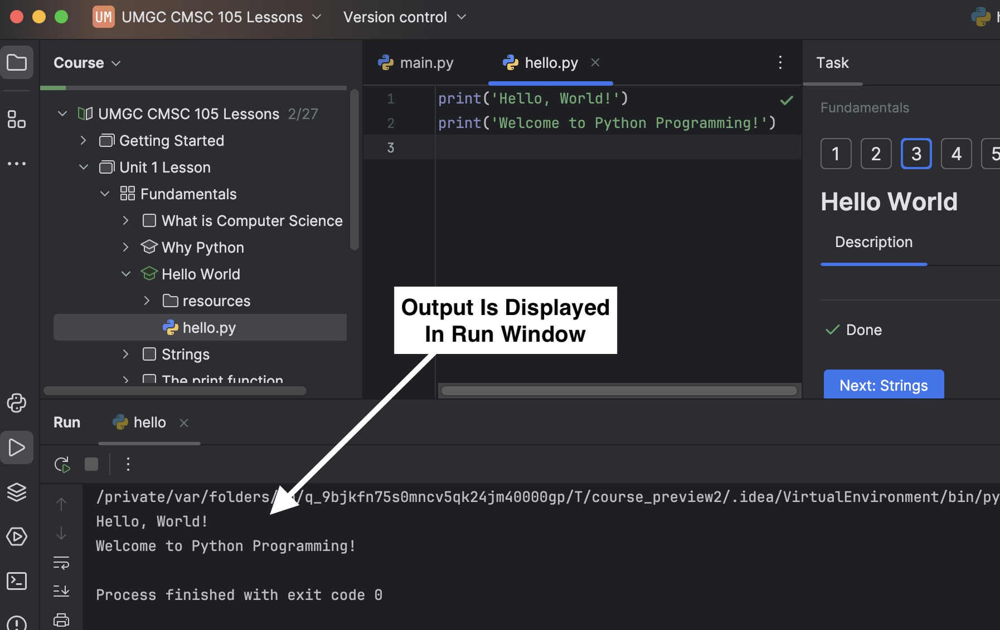

Let's examine a simple Python program, or Python script, that prints a greeting.

The code editor in the center of the screen shows the contents of the `hello.py` file.

- The file contains two print statements that utilize the `print()` function to display text on the screen.
- When you **run** `hello.py`, the two print statements are executed one after the other.

### How to Run `hello.py`

There are several ways to run `hello.py` in PyCharm. Try each of the following methods to execute the code:

| **Method**                                      | **Example**                                                                |
|-------------------------------------------------|----------------------------------------------------------------------------|
| **Right-click in the Editor**, then select **Run 'hello'**  |  |
| **From the Menu Bar**, select **Run > Run 'hello.py'**      |       |
| **Use the Shortcut** ⌃⇧R (Mac) or **Ctrl+Shift+R** (Windows/Linux) |                                                                            |

When you run the code, PyCharm will display the output in the **Run Window** at the bottom of the screen.

**Challenge:** Try modifying the code to change the greeting that is printed. Just be sure not to remove the single quotes around the text.

> **Note:** The terms **"run a program"** and **"execute a program"** will be used interchangeably throughout the lessons.
