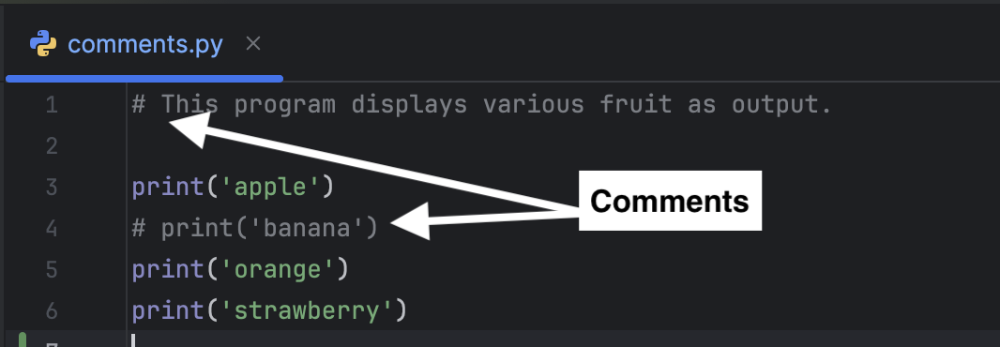

Comments are included in code to improve readability, explain complex logic, document design decisions, and serve other purposes.

Single-line comments begin with the hash symbol (#) and are typically followed by a space. Everything after the hash symbol up to the end of the line is ignored by the program during execution.

In `comments.py`, lines 1 and 4 are commented out, so they are skipped when the program executes.
- Line 1 offers a short description of the code's function.
- Line 4 is commented out to prevent 'banana' from appearing in the output.

### Code Challenge

Click the "Check" button. The test fails because the output excludes 'banana' and includes 'strawberry'.

1. Remove the comment character `# ` on line 4 so that 'banana' is printed.
2. Comment out line 6 (don't delete it) to prevent 'strawberry' from being printed.
3. Click the "Check" button to confirm the code is correct.