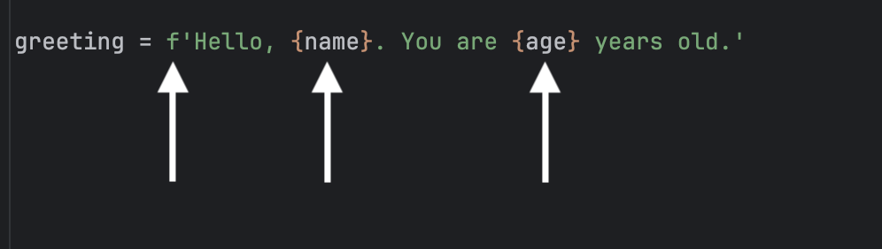

F-strings (formatted string literals) provide a concise and readable way
to embed expressions inside string literals. They are created by prefixing
a string with the letter `f` or `F`, and expressions inside curly braces 
`{}` are evaluated at runtime.

For example:

```python
name = 'Jeron'
age = 25
greeting = f'Hello, {name}. You are {age} years old.'
print(greeting)
```

Output:
```
Hello, Jeron. You are 25 years old.
```

In this example, the values of `name` and `age` are inserted directly into the string where the curly braces are placed. 



F-strings make it easy to format strings without needing to use concatenation or other formatting methods.

**NOTE:** Rather than assign a new variable `greeting` to an f-string, you can define the f-string
as an argument to the print statement as shown below:

```python
name = 'Jeron'
age = 25
print(f'Hello, {name}. You are {age} years old.')
```
