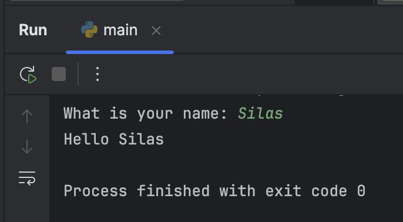

So far, the programs we've seen produce the same output every time they are run.

Things get more interesting when the program interacts with the user, asking for input and generating output based on that input.

As a simple example, the code in `say_hello.py` asks the user for their name and then greets them using that name.

Run the program a few times and input different names.

`name = input('What is your name: ')`
   - The `input()` function displays the prompt "What is your name: " to the user.
   - Python waits for the user to enter their name and press Enter.
   - The entered name is stored in the `name` variable.

`print('Hello', name)`
   - The `print()` function displays "Hello" followed by the value stored in the `name` variable, greeting the user.
   - Notice that two comma-separated values are passed to the `print()` function: the string `'Hello'` and the `name` variable. You can pass multiple expressions into the function, and they will be printed with a space separating them.