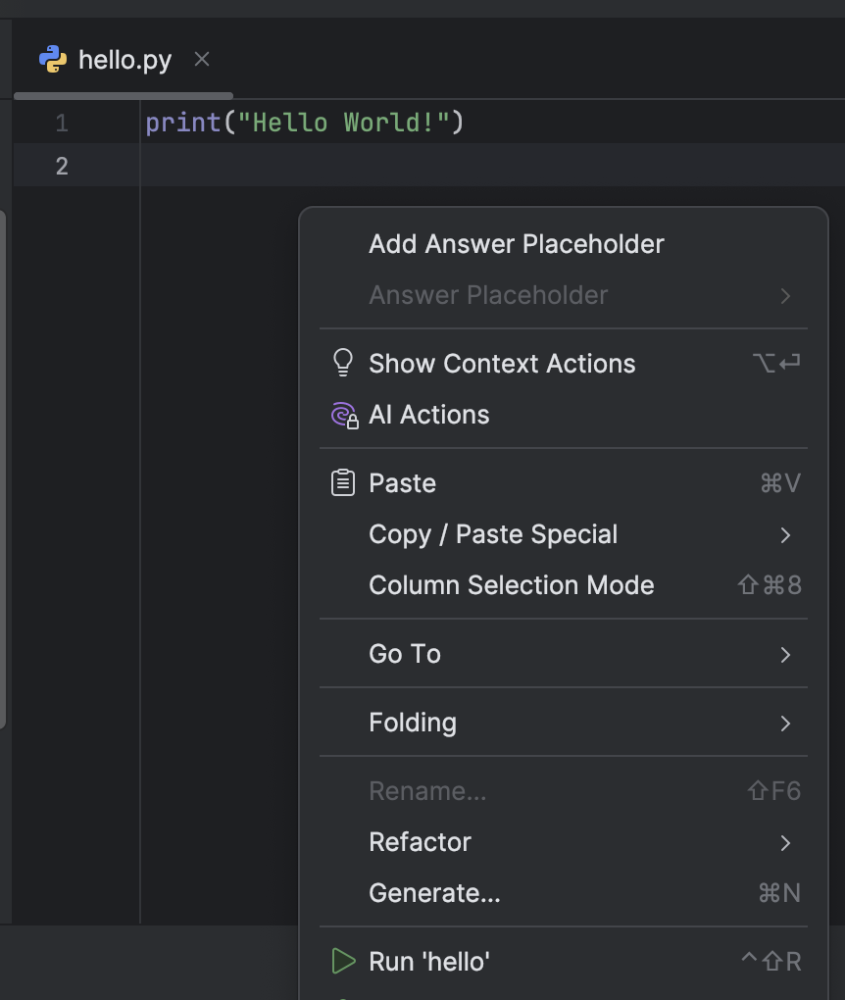

## Our first program

Let's look at some Python code to print a simple message.

The file hello.py contains a print statement that produces `"Hello World!"` as  output.

To run the code, right-click anywhere in the **Editor** view so you can see the context menu and select **Run 'hello'**.
Alternatively, you can use the &shortcut:RunClass; shortcut. 

You should see a new output window with the text "Helo World!" displayed in the PyCharm IDE.

For more information on how to run a program, check out [PyCharm Help](https://www.jetbrains.com/help/pycharm/running-and-rerunning-applications.html).