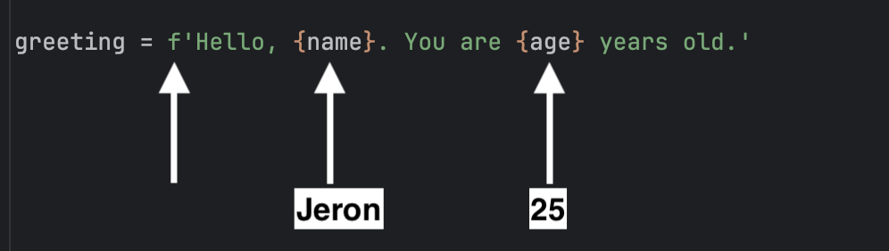

F-strings (formatted string literals) offer a simple way to insert variables and expressions directly into string literals. An f-string is created by prefixing a string literal with the letter `f` or `F`, and expressions within curly braces `{}` are evaluated at runtime.

For example, if you run `f_string.py` you should see the following output:

```
Hello, Jeron. You are 25 years old.
```

Notice how he values stored in the variables `name` and `age` are inserted into the string.



You can also use an f-string directly in the print statement, avoiding the need to create an additional variable:

```python
name = 'Jeron'
age = 25
print(f'Hello, {name}. You are {age} years old.')
```

## Comprehension Check

Which of the following will print *The car is red.*