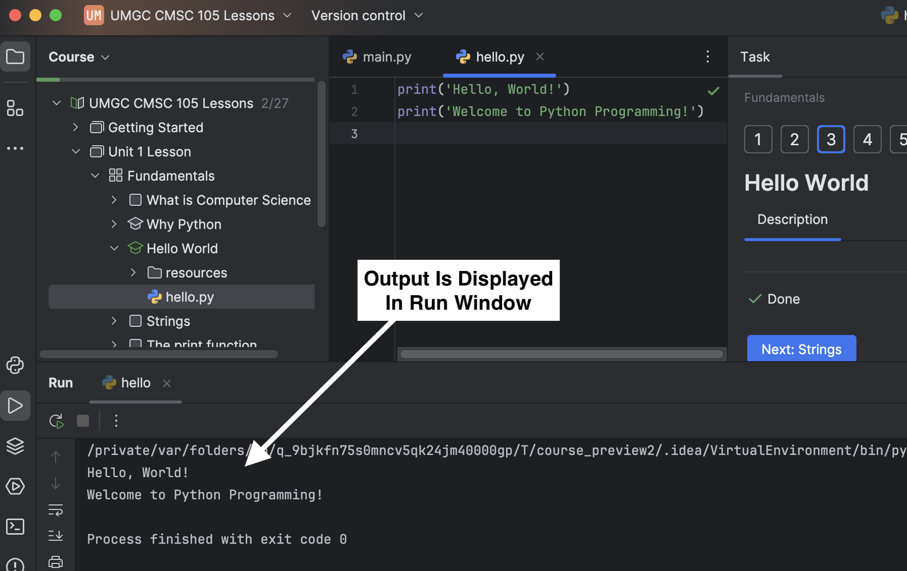

Let's examine a simple Python program, or Python script, that prints a greeting.

- The code editor in the center of the window shows the contents of the `hello.py` file.

- The two lines of code call the `print()` function to display text as output.

When you run the code, PyCharm will display the program output in the **Run Window** at the bottom of the screen.

### How to Run `hello.py`

There are several ways to run `hello.py` in PyCharm. Try each of the following:

| **Alternative Methods**                                                                           | **Screen Shot**                                                         |
|---------------------------------------------------------------------------------------------------|-------------------------------------------------------------------------|
| Right-click in the **Editor** window, then select **Run 'hello'**                                 |  |
| From the Menu Bar, select **Run > Run 'hello'**                                                   |       |
| Click anywhere in the **Editor** window, then type ⌃⇧R (Mac) or Ctrl+Shift+R (Windows/Linux) |   |

The terms **"run a program"** and **"execute a program"** will be used interchangeably throughout the lessons.
