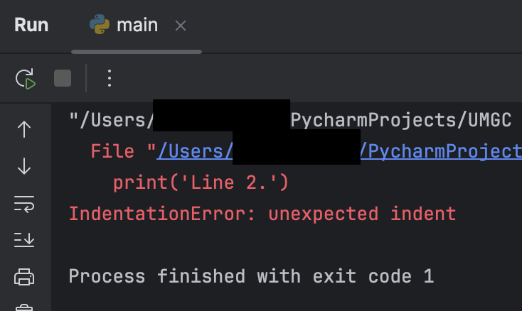

In Python, indentation is used to define the structure
of the code. There is an indentation error in `main.py` that prevents
the code from running. 
- Line 1 and 3 are correct in that there are no spaces before the `print()` function call.
- Line 2 has an indentation error due to the extra spaces at the beginning of the line. The red underlines on line 2 indicates an error.

Try running `main.py`. You should see an error message similar to the following:

## Code Challenge

Fix the error by removing the extra indentation in line 2, then
re-run the program and confirm 3 lines of output.

print('Line 1.') 
print('Line 2.') 
print('Line 3.')

