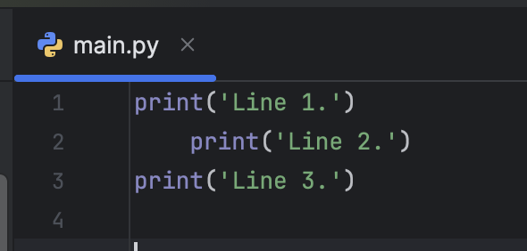
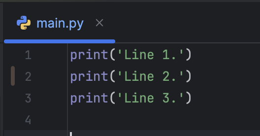

In Python, indentation defines the structure of the code.

The editor displays the code from `indent.py`. There is an indentation error that prevents the code from running.  

| Incorrect:  Line 2 contains unnecessary indentation | Correct: No indentation                                                                           |
|---------------------------------------------|------------------------------------------------------------------------------------------------------------|
|  | |

- Lines 1 and 3 are correct because there are no spaces before the `print()` function call.  
- Line 2 is incorrect due to the extra spaces at the start of the line.

Try running `indent.py`, and you should see an error message like the one below:

## Code Challenge

To fix the error, remove the indentation on Line 2, then re-run the program to confirm that three lines of output appear.