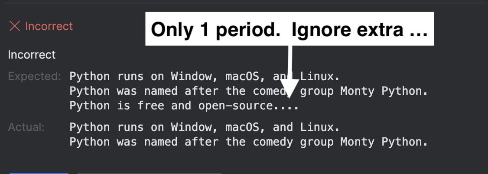

### Code Challenge

The file `python_facts.py` should print three facts about Python. 
However, if you look at the code, it currently only prints two facts.

Click the "Check" button to compare the program's actual output to the expected output. 
The check will fail because only two lines are printed.

*NOTE: Ignore the three extra periods `...` at the end of the expected output; they represent a newline character.*

1. Modify `python_facts.py` to include the missing third fact: 'Python is free and open-source.'
2. Click the "Check" button again to verify the code is correct.

