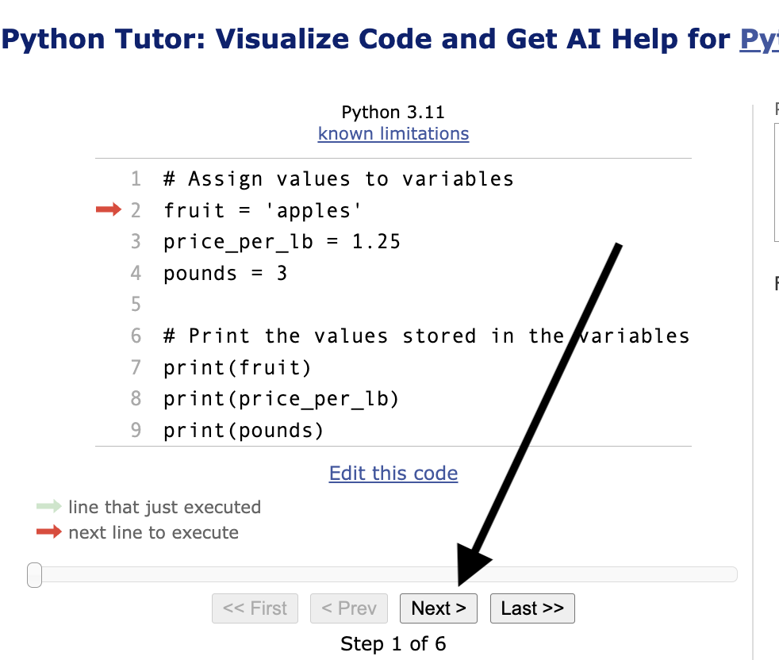

## Visualizing Variables in Memory

Python Tutor is an online tool that helps you visualize what
happens in memory as your program runs.

1. Click
<a href="https://pythontutor.com/render.html#code=%23%20Assign%20values%20to%20variables%0Afruit%20%3D%20'apples'%0Aprice_per_lb%20%3D%201.25%0Apounds%20%3D%203%0A%0A%23%20Print%20the%20values%20stored%20in%20the%20variables%0Aprint%28fruit%29%0Aprint%28price_per_lb%29%0Aprint%28pounds%29&cumulative=false&curInstr=0&heapPrimitives=nevernest&mode=display&origin=opt-frontend.js&py=311&rawInputLstJSON=%5B%5D&textReferences=false" alt="pythontutor.com code visualization">visualize variables.py</a> to run the code using the Python Tutor.
2. Repeatedly click the "Next" button to execute one line at a time.  Notice how each variable is assignd a memory location where the value is stored.  The value stored in the variable will be printed.

