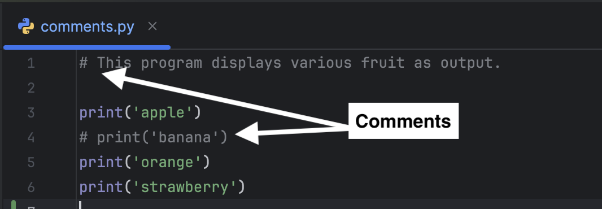

Comments are commonly used in code to enhance readability and explain complex logic.

Single-line comments start with the hash symbol (#) and are usually followed by a space. Any text after the hash symbol, up to the end of the line, is ignored during program execution.

In `comments.py`, lines 1 and 4 are commented out and will be skipped when the program runs.

### Code Challenge

Click the "Check" button. The test fails because the output excludes 'banana' and includes 'strawberry'.

1. Remove the comment `# ` on line 4 so that *banana* is printed. Make sure to remove both the hash symbol and the space.
2. Comment out line 6 (don't delete it) to prevent *strawberry* from being printed.
3. Click the "Check" button to confirm the code is correct.