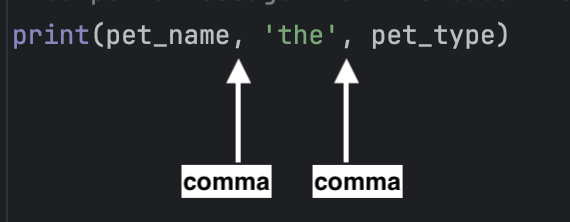

Many software applications involve user interaction, where the user provides input and the program generates output based on that input.

In the code in `pet_io.py`, the program asks the user for their pet's type and name, then prints a message with that information.

Run the code multiple times, entering different values for the pet's type and name, and observe the output.

| Example #1                                                               | Example #2                                                               |
|----------------------------------------------------------------------------|----------------------------------------------------------------------------|
|  |  |

Let's break down the code:

`pet_type = input('Pet type: ')`
   - This shows the prompt 'Pet type: '.
   - Python waits for the user to enter a value and press Enter.
   - The entered value is stored in the `pet_type` variable.

`pet_name = input('Pet name: ')`
   - This shows the prompt 'Pet name: ', and the entered value is saved in the `pet_name` variable.

`print(pet_name, 'the', pet_type)`
   - Three arguments are provided to the `print()` function, separated by commas. 
   

   - Variables `pet_name` and `pet_type` are not enclosed in quotes, so their values are printed.  The string 'the' however is enclosed in quotes.
   - Python will display the three values on a single line, with spaces between them.
   

