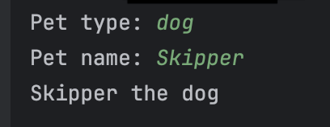
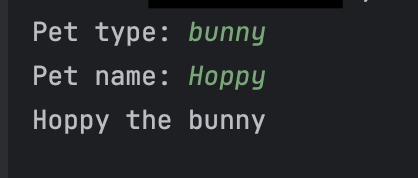

Let's look at a program that asks the user for input and generates output based on their response.

The `pet_io.py` file asks the user for their pet's type and name,
then prints a message that includes the pet data.  

Run the code multiple times with different input values. For example:

| Example #1                                                                   | Example #2                                                                   |
|------------------------------------------------------------------------------|------------------------------------------------------------------------------|
|  |  |

Now, let's review each line of code:

`pet_type = input('Pet type: ')`
   - The `input()` function shows the prompt 'Pet type: '.
   - Python waits for the user to type a value and hit Enter.
   - The input is stored in the `pet_type` variable.

`pet_name = input('Pet name: ')`
   - Similarly, the prompt 'Pet name: ' appears, and the entered value is saved in the `pet_name` variable.

`print(pet_name , 'the', pet_type)`
   - Here, three comma-separated values are passed to the `print()` function. Multiple arguments can be passed, and Python automatically adds spaces between the values when displaying the output.