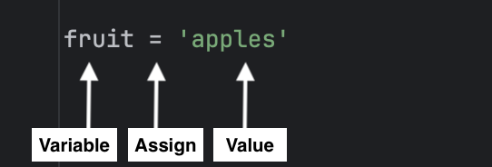

One of Python's key features is the ability to define
variables. A **variable** is essentially a label that refers to a value.

In Python, assigning a value to a variable is done using the '`=`' symbol, known as the assignment operator. The variable name is on the left side of the `=` operator, and the value is placed on the right side.



You can use *fruit* throughout your program, and it will refer to the value *'apples'* until the variable is reassigned to something else.

The file `variables.py` assigns values to three variables `fruit`, `price_per_lb`, and `pounds`, then prints the variables.
Note that the variables are **not** enclosed in quotes
in the print statements. This allows the values to be printed instead of the variable names.

## Comprehension Check

Run the code in `variables.py` to view the output. What value is printed by this line:

```python
print(price_per_lb)
```